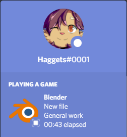
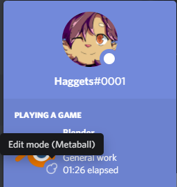
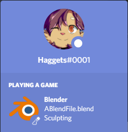
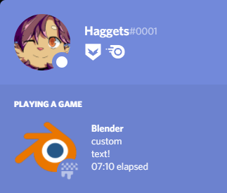
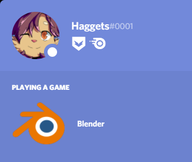
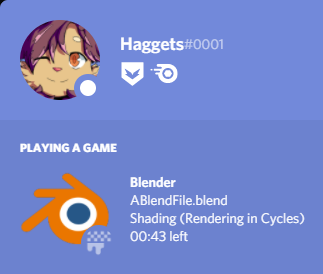

 

# Blender Rich Presence Plus
Another Blender Rich Presence plugin that unlike the rest, gives you total control in terms of customization, being able to freely modify what to show, and where to show it.

## Features

* Show the version Blender is currently on, the current blend file name, its full path or relative folder, the size of the blend file, the current workspace, with more customizability coming by your suggestions!
* Show all of that information wherever and in whatever position you want (Want to put just the file size on the lower row or the relative folder in the big icon hover text? Go for it), as well as custom text which can be whatever you want, before, between and/or after that information
* Filter out specific workspaces (Hide every workspace except the shading workspace, for example)
* Show the current state/mode the user is on (Object mode, Edit mode (Which includes every type of edit mode with their respective icon), sculpt mode...) or nothing at all
* Filter out specifc states/modes (Hide every state except object mode, for example)
* Show the current render engine being used while rendering, or keep the engine a secret and only display if you're currently rendering
* Show elapsed time since you booted up Blender, or not
* Show elapsed time since you began a render for single frame renders (The prior time will resume itself after the render is over)
* Show an estimate time to when your render will be finished when rendering multiple frames (NOT 100% accurate)

## Examples

  

   

As you can see, this plugin was made with the intention of providing as much customizability as possible in case you need or want something different, so if you want as much or as little information as possible shown about your current Blender session, this plugin will not disappoint

## How to Install
The plugin is installed like any other, you go to the Blender preferences, Addons, click on install, and select the plugin; enable it and you're good to go. The customization panel is in the same addons panel by opening the addon's panel.
